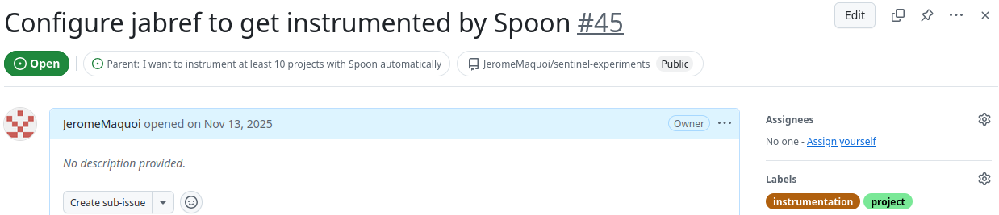
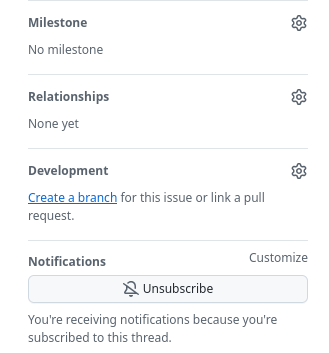
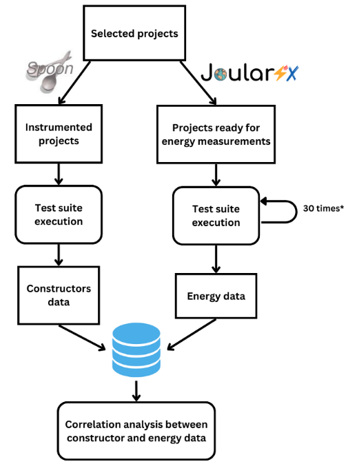

# Sentinel Experiments

This project is a pipeline-based tool for making experiments on projects during my PhD thesis. The idea is to have a modular architecture to fit my needs, and to be able to easily add new projects and new kinds of experiments. For now, the pipeline consists of those modules:
- **EnergyMeasurementsModule**: measures the actual energy consumption of Java applications using JoularJX
- **SpoonInstrumentConstructorModule**: instruments Java source code to track constructor invocations using Spoon and sends the data to a backend for storage and analysis

Each module consists of a series of stages that are executed in sequence. Each stage performs a specific task, such as cloning a repository, running the tests. The stages are designed to be reusable and configurable, so that they can be easily adapted to different projects and experiments.

---

## Table of contents

* [Projects Status Overview](#projects-status-overview)
* [Contributing to sentinel-experiments](#contributing-to-sentinel-experiments)
  * [Resolving Issues](#resolving-issues)
  * [Adding a new project to analyze](#adding-a-new-project-to-analyze)
  * [Steps to analyze a new project](#steps-to-analyze-a-new-project)
* [Projects selection criteria](#projects-selection-criteria)
* [EnergyMeasurementsModule](#energymeasurementsmodule)
  * [Purpose](#purpose)
  * [How It Works](#how-it-works)
  * [JoularJX](#joularjx)
* [SpoonInstrumentConstructorModule](#spooninstrumentconstructormodule)
  * [Purpose](#purpose-1)
  * [How It Works](#how-it-works-1)
* [Data Flow Diagram](#data-flow-diagram)
* [Pipeline Configuration](#pipeline-configuration)
  * [Configuration File Naming Convention](#configuration-file-naming-convention)
  * [Pipeline Configuration File Structure](#pipeline-configuration-file-structure)
  * [Classpath configuration for Spoon instrumentation](#classpath-configuration-for-spoon-instrumentation)

# Projects Status Overview

| Project Name              | JoularJX Status | Spoon Status   | Remaining Configuration TODOs |
|---------------------------|:---------------:|----------------|-------------------------------|
| **checkstyle**            |   🟢 Working    | 🟢 Working     | /                             |
| **commons-configuration** |    🔵 To Do     | 🔵 To Do       |                               |
| **hibernate-orm**         |    🔵 To Do     | 🟡 In Progress |                               |
| **jabref**                | 🟡 In Progress  | 🔵 To Do       |                               |
| **OpenJDK**               |    🔵 To Do     | 🔵 To Do       |                               |
| **spoon**                 |   🟢 Working    | 🟡 In Progress |                               |
| **spring-boot**           |   🟢 Working    | 🟢 Working     | /                             |


## Status Legend

| Icon               | Meaning                                                                                          |
|--------------------|--------------------------------------------------------------------------------------------------|
| 🟢 **Working**     | Fully configured and running successfully within the pipeline                                    |
| 🟡 **In Progress** | Configuration in progress, partial setup completed, requires further adjustments                 |
| 🔴 **Not Working** | Fails during setup or measurement stages, too difficult to analyze. The project will not be used |
| 🔵 **To Do**       | Project not yet configured or analyzed                                                           |

# Contributing to sentinel-experiments
All contributions to this project are welcome! For simplicity, **all changes are made on a fork of the repository, and then a pull request is created to merge the changes into the main repository**. This way, we can easily track the changes and review them before merging.

## Resolving Issues
**If you find a bug or have a feature request, please open an issue on GitHub**. When opening an issue, please provide as much detail as possible, including steps to reproduce the issue, expected behavior, and any relevant screenshots or logs.

If you know how to fix the issue, feel free to resolve it yourself by submitting a pull request. Please ensure that your code includes appropriate tests and follows the common coding standards of Java.

## Adding a new project to analyze
To add a new analyzed project, please follow these steps:
1. **Choose a new project to analyze**, based on the criteria from the [Projects selection criteria](#projects-selection-criteria) section.
2. Go to the [backlog of the project](https://github.com/users/JeromeMaquoi/projects/7/views/8) and **create new issues for the project you want to add**. Two issues should be created per project: one for the energy measurements and one for the instrumentation.
    - The issue related to the energy measurements should be labeled with "project" and "energy measurements", and should be a sub-issue of the issue ["#22 I want to measure the energy consumption of at least 10 Java projects automatically"](https://github.com/users/JeromeMaquoi/projects/7/views/8?pane=issue&itemId=137163684&issue=JeromeMaquoi%7Csentinel-experiments%7C22)
    - The issue related to the instrumentation should be labeled with `project`and `instrumentation`, and should be a sub-issue of the issue [#42 I want to instrument at least 10 projects with Spoon automatically](https://github.com/users/JeromeMaquoi/projects/7/views/8?pane=issue&itemId=139220510&issue=JeromeMaquoi%7Csentinel-experiments%7C42)

   For example, here is the issue related to the instrumentation of the project Jabref:
   

   And here is the issue related to the energy measurements of Jabref:
   

   You can see that both have a parent issue, either the issue [#22](https://github.com/users/JeromeMaquoi/projects/7/views/8?pane=issue&itemId=137163684&issue=JeromeMaquoi%7Csentinel-experiments%7C22) for the energy measurements, or the issue [#42](https://github.com/users/JeromeMaquoi/projects/7/views/8?pane=issue&itemId=139220510&issue=JeromeMaquoi%7Csentinel-experiments%7C42) for the instrumentation. This way, we can easily track the progress of adding new projects to the repository.
3. **Once an issue is created, you can create a new branch on your fork**, linked to this issue.
   
4. **You can follow the [steps to analyze the project](#steps-to-analyze-a-new-project)**. Please make sure to work only on either the energy measurements or the instrumentation on one branch, and not both. This way, we can easily track the progress of each task separately.
5. **Once you are done, please create a pull request to merge your changes into the main repository (not the fork!)**. This pull request will be reviewed by me, and once it is approved, it will be merged into the main repository.

## Steps to analyze a new project

There are two main modules in the pipeline: the EnergyMeasurementsModule and the SpoonInstrumentConstructorModule. There are some common steps to follow to analyze a new project with both modules, and some specific steps for each module.

> [!NOTE]
> Don't forget that you have to work on each module in a separate branch!

### Common steps for both modules

1. **Create a new wip configuration file** in the root of the repository, following the naming convention explained in the [Pipeline configuration](#pipeline-configuration) section. You can use an existing configuration file as a template and update it with the information of the new project you want to analyze.
2. **Update the configuration file** with the correct information for the new project, such as the repository URL, the commit to analyze, the test command, etc. Make sure to update all the necessary properties in the configuration file, and to keep the properties that should not be updated as they are.
3. **Create a new directory in `resources/build-files/`** with the exact name of the analyzed project. If the analysis is done on a sub project, the name of the directory must follow this format: `<root-project-name>.<sub-project-name>`. For example, in the case of spring-boot, the analyzed sub project is "spring-boot/spring-boot-project/spring-boot", so the name of the directory within `resources/build-files/` is `spring-boot.spring-boot-project.spring-boot`.

### Specific steps for the EnergyMeasurementsModule

1. Create the `config.properties` file for JoularJX configuration in the `resources/build-files/<project-name>/` directory, following the instructions of the [Configuration of JoularJX config.properties](#configuration-of-joularjx-configproperties) section of the documentation.
2. **Copy-paste the `pom.xml` or `build.gradle`** (or `build.gradle.kts`) file from the analyzed project into the `resources/build-files/<project-name>/` directory of the sentinel-experiments project, **and update it to add JoularJX as a Java agent**, following the instructions of the [Add JoularJX as a Java agent to the analyzed project](#add-joularjx-as-a-java-agent-to-the-analyzed-project) section of the documentation.
3. **Test the configuration file by running the energy measurements module** of the pipeline with this command (in linux):
    ```bash
    sudo bash ./sentinel-experiments.sh measure --config wip-config-<PROJECT_NAME>.yml
    ```
    If the pipeline does not crash in the terminal, a new directory `joularjx-results` will be created in analyzed directory of the project (either the root directory or the sub project directory, depending on the configuration). If this directory is created and contains other directories and csv files, it means that JoularJX is correctly configured and is able to run and collect energy measurements for the analyzed project.
4. **If the pipeline is working (see point 3), you can now create a complete configuration file** for the project by copying the wip configuration file and renaming it to `config-<project-name>.yml`.

### Specific steps for the SpoonInstrumentConstructorModule

1. **Copy-paste the `pom.xml`or `build.gradle`** (or `build.gradle.kts`) file from the analyzed project, but this time in the `resources/build-files/<project-name>/classpath` directory of the sentinel-experiments project, **and update it to add a task that will build the classpath of the analyzed project**, as explained in the section [Classpath configuration for Spoon instrumentation](#classpath-configuration-for-spoon-instrumentation).
2. **Test the configuration file by running the Spoon module** of the pipeline with this command (in linux):
    ```bash
    sudo bash ./sentinel-experiments.sh instrumentconstructor --config wip-config-<PROJECT_NAME>.yml
    ```
   If the pipeline arrives to the `RunInstrumentedProjectTestsStage` stage and runs the tests of the analyzed project without crashing, and if you can see logs like `Context <name of the constructor> sent successfully` during the execution, it means that the Spoon module is correctly configured and is able to instrument the constructors of the analyzed project and send the data to the backend.
3. **If the pipeline is working (see point 2), you can now create a complete configuration file** for the project by copying the wip configuration file and renaming it to `config-<project-name>.yml`.


# Projects selection criteria
The analyzed projects need to satisfy the following criteria (**this list is not yet finished and will be updated**):
- The project must be a Java project, using either Maven or Gradle as a build system
- The project must have a test suite that can be executed with a single command (e.g., `mvn test` or `./gradlew test`)
- The project must be active and maintained
- The project must be open-source

# EnergyMeasurementsModule

## Purpose
Measures the energy consumption of a Java project by:
- Cloning and setting up the target repository
- Building and preparing the project
- Running the project multiple times with JoularJX as a Java agent to collect energy consumption data
- Sending the collected data to the database

## How It Works

The module executes stages in three phases:

### Phase 1: Setup & Preparation

**CloneAndCheckoutRepositoryStage**
- Clones the target repository from Git from a specified URL (`repo.url`) into a local directory (`repo.target-dir`)
- Checks out the specified commit in the configuration (`repo.commit`)

**Tool-specific Setup Stages** (created by the EnergyMeasurementTool)
- Installs and configures the energy measurement tool (e.g., JoularJX)
- Prepares the environment for measurements, such as setting up necessary Java agents or configuration files

For now, there is only one energy measurement tool implemented: JoularJX. The stages for setting up JoularJX are the following:
- **RetrieveToolReleaseStage**: Checks if the specified version of JoularJX is already installed locally. If not, it downloads the release from the provided URL (`execution-plan.energy-measurements.release-url`) and installs it in the specified tool path (`execution-plan.energy-measurements.tool-path`).
- **CopyFileStage** (for build files): Copies the necessary build files (either build.gradle or pom.xml) based on the project configuration.
- **UpdateBuildFileStage**: Updates the build file (maven or gradle) to add the actual tool path of JoularJX to the project configuration, so that JoularJX can be used during the test suite execution. This stage needs to be executed right after copying the build file, so that the build file is updated with the correct tool path.
- **CopyFileStage** (for JoularJX configuration): Copies the config.properties (more on this file [here](#configuration-of-joularjx)) file from the resources (resources/build-files/<project-name>/config.properties) to the project directory. This file contains all the configuration for executing JoularJX.
- **SetupJdkStage**: Detects, installs and configures the correct JDK version for the analyzed project, based on the configuration (`repo.jdk`).

### Phase 2: Measurement (Repeated for each test run)

The measurements stages are repeated according to the `num-test-runs` configuration property, allowing for multiple runs to ensure data reliability. All the stages in this phase are executed for each test run:
- **SetDirectoryStage**: Sets the current working directory to the analyzed project directory, so that all the commands are executed in the correct context.
- **RunProjectTestsStage**: Executes the test suite of the analyzed project using the specified test command (`execution-plan.test-command`). During this test suite execution, JoularJX is used as a Java agent to collect energy consumption data of the test suite (more on JoularJX [here](#joularjx)).

### Phase 3: Post-Processing

The post processing stages are executed after all the test runs are completed. These stages are responsible for processing the raw data collected by JoularJX and storing it in the database:
- **StopBackendStage**: Stops any running backend services to ensure a clean state for data import
- **PrepareBackendStage**: Starts the backend services and MongoDB where the data will be stored, with the configuration properties specified in the configuration file (`backend` section)
- **ImportJoularJXMeasurementsStage**: Sends the raw data collected by JoularJX to the backend.

## JoularJX

JoularJX is a Java agent that can be attached to any Java application to collect energy consumption data. It provides detailed measurements of energy usage at the method level, allowing for fine-grained analysis of which parts of the code are consuming the most energy.

### Configuration of JoularJX config.properties

The configuration of JoularJX is done through a `config.properties` file that is in `resources/build-files/<project-name>` directory. This file must contain all the necessary configuration for running JoularJX for the analyzed project. Here is the content of this file with explanations for each property. **The only property that needs to be updated is the property `filter-method-names`**, with the package where all the code of the analyzed project are located. The other properties must be kept as they are.

```properties
# Get also power and energy for methods starting with this package.class.method name
# Example: filter-method-names=Package to filter energy for all methods whose full name start with Package
# Note that JoularJX will always generate energy for all non-filtered method in a separate file
# So you can safely keep this empty if you don't want to filter methods
# You can add multiple identifiers names separated by a comma, ordered by priority
# JoularJX will monitor and filter methods for all these packages
# Example: filter-method-names=Package,Package2,Package3
# =========
# TO UPDATE
filter-method-names=org.springframework.boot
# =========

# Write runtime methods power consumption in a CSV file
# Setting this option to false won't generate any runtime files
# Allowed values: true, false
save-runtime-data=true

# Overwrite runtime power data file
# Setting it to false will write files for every monitoring cycle (1 sec per cycle)
# Allowed values: true, false
overwrite-runtime-data=false

# Logging level
# Set to OFF to disable it
# Allowed values: OFF, INFO, WARNING, SEVERE
logger-level=INFO

# Track power consumption evolution of methods
# Setting this option to true will generate one CSV file per monitored method
# Each CSV file will contain the power consumption on every monitored timestamp
# Allowed values: true, fase
track-consumption-evolution=false

# If track-consumption-evolution is set to true, the CSV files will be stored at the given path
# On Windows, please escape slashes twice
evolution-data-path=evolution

# If enabled (true), the consumption of the methods related to any of the agent threads will not be reported.
# Allowed values: true , false
hide-agent-consumption=true

# If set to true, a CSV file will be generated at agent's end, containing the total energy consumption of each call tree.
# Allowed values: true, false
enable-call-trees-consumption=true

# Write runtime call trees power consumption in a CSV file.
# By default, a new CSV file will be generated for each monitoring cycle.
# Setting this option to false won't generate any runtime files
# Allowed values: true, false
save-call-trees-runtime-data=true

# Overwrite runtime call trees power data file. If set to true, only one runtime file will be generated, and it will be overwritten for each monitoring cycle.
# Setting it to false will generate new files for every monitoring cycle (1 sec per cycle). The said files ill include timestamps in their name.
# Allowed values: true, false
overwrite-call-trees-runtime-data=false

# The sample rate (milliseconds) for the agent to monitor the JVM call
# stack. Lower means more accurate monitoring. Allowable values are
# from 1 to 1000.
stack-monitoring-sample-rate=10

# If running the application on top of an application server or framework (spring, tomcat, etc.)
# This changes how JoularJX loops when monitoring, using a while-true loop instead of a checking if the JVM is destroyed
# On standard Java applications, the while-true loop don't quit when the application ends, hence why destroying the VM
# Values: true, false
application-server=false

# Path for our power monitor program on Windows
# On Windows, please escape slashes twice
powermonitor-path=C:\\joularjx\\PowerMonitor.exe

# Monitoring inside virtual machines
# Values: true, false
vm-monitoring=false

# Path for power consumption of the virtual machine
# Inside a virtual machine, indicate the file containing power consumption of the VM
# File usually shared with host to propagate the power of the VM from the host
# And use this value as the emulated CPU power inside the VM
vm-power-path=/tmp/power.csv

# Power format of the shared VM power file
# We currently support two formats:
# powerjoular: a csv file generated by PowerJoular in the host, containing
#              3 columns: timestamp, CPU utilization of the VM and CPU power of the VM
# watts: a file containing one float value which is the power consumption of the VM
# Values: powerjoular, watts
vm-power-format=watts
```

### Add JoularJX as a Java agent to the analyzed project
To use JoularJX for energy measurements, you need to add it as a Java agent to the test execution of the analyzed project. This can be done by updating the build file (pom.xml for maven or build.gradle for gradle) of the analyzed project to include the JVM argument for the Java agent. Here is how to do it for both build systems.

#### Maven projects (pom.xml)
You need to add the following configuration to the `pom.xml` file of the analyzed project, inside the `build` section. This configuration adds the JVM argument for the Java agent to the surefire plugin, which is responsible for running the tests in maven.

```xml
<build>
    ...
    <plugins>
        ...
        <plugin>
            <groupId>org.apache.maven.plugins</groupId>
            <artifactId>maven-surefire-plugin</artifactId>
            <version>...</version>
            <configuration>
                ...
                <argLine>
                    ...
                    -javaagent:JOULARJX <!-- This is the line to add to the pom.xml. Copy-paste it without touching anything (especially, do not touch the JOULARJX word) -->
                </argLine>
            </configuration>
        </plugin>
        ...
    </plugins>
    ...
</build>
```

#### Gradle projects (build.gradle or build.gradle.kts)
You need to add the following configuration to the `build.gradle` file of the analyzed project. This configuration adds the JVM argument for the Java agent to the test task, which is responsible for running the tests in gradle.

If there is a `test {...}` block in the file, you can add the following line to this block:

```groovy
test {
    ...
    jvmArgs += "-javaagent:JOULARJX" // This is the line to add to the build.gradle. Copy-paste it without touching anything (especially, do not touch the JOULARJX word)
}
```

If there is no `test {...}` block in the file, but there is a `tasks.withType(Test.class) {...}` block, you can add the following line to this block:

```groovy
tasks.withType(Test.class) {
    ...
    test.jvmArgs(["-javaagent:JOULARJX"]) // This is the line to add to the build.gradle. Copy-paste it without touching anything (especially, do not touch the JOULARJX word)
}
```

If there is none of these blocks in the file, come and talk to me, we will find a way to add the JVM argument for the Java agent in this case ;)

---

# SpoonInstrumentConstructorModule

## Purpose
Instruments Java source code to track constructor invocations by:
- Cloning and preparing the target repository
- Building a classpath for analysis
- Using Spoon to instrument all constructors
- Running tests on the instrumented code
- Storing instrumentation results

## How It Works

The module executes the following stages in sequence:

1. **StopBackendStage**:  Stops any running backend services and clears previous data

2. **PrepareBackendStage**: Starts MongoDB and backend services where all the data will be stored

3. **CloneAndCheckoutRepositoryStage**: Clones the target repository and checks out a specific commit

4. **CopyDirectoryStage**: Creates a copy of the project directory into a new one, for safe instrumentation during the SpoonInstrumentConstructorModule execution

5. **CopyFileStage** (classpath): Copies a file from a source to a destination, used for copying necessary build files for the instrumentation process

6. **BuildClassPathStage**: Creates the class path of the analyzed project, so that it can be used by Spoon in the instrumentation process

7. **CopyFileStage** (instrumentation): Copies instrumentation specific build files

8. **InstrumentConstructorsStage**: Uses Spoon to analyze and instrument every constructor in the codebase

9. **CopySourceCodeStage**: Copies the source code of the package "spoon.constructor_instrumentation" from the Sentinel project into the instrumented project. This code is used in the instrumentated code to send data about constructor invocations to the backend

10. **CopyProjectJavaFilesStage**: Copies some specific Java files from the "resources/java-files" directory of the sentinel-experiments project into the instrumented project. The files copied during this stage are problematic files that causes the project to fail, if they are instrumented by Spoon. By copying them after the instrumentation process, we make sure that they are not instrumented and that the project can be built and tested successfully

11. **RunInstrumentedProjectTestsStage**: Runs the project's test suite on the instrumented code, collects constructor data and sends it to the backend for storage

---

# Data Flow Diagram



---

# Pipeline Configuration

This section explains how to create configuration files for new projects.

## Configuration File Naming Convention

- **Work in Progress**: `wip-config-<PROJECT_NAME>.yml` (e.g., `wip-config-jabref.yml`)
  - Use this while developing and testing your configuration
  - These files are not yet ready for server execution
  - Be careful, those files are ignored by Git, so they won't be added to the repository.

- **Complete & Tested**: `config-<PROJECT_NAME>.yml` (e.g., `config-spring-boot.yml`)
  - Use this when your configuration is validated and working
  - These files are ready for execution on the analysis server

## Pipeline Configuration File Structure

Here's a complete example configuration with explanations. The properties that need to be updated for each new project are marked with a comment `TO UPDATE`. The other properties don't need to be updated and can be kept as they are.

```yaml
# Maximum execution time (in seconds) for the entire pipeline
command-time-out: 3600

# Path to the Spoon constructor instrumentation code
code-constructors-instrumentation-path: "/path/to/sentinel-experiments/src/main/java/be/unamur/snail/spoon/constructor_instrumentation" # <===== TO UPDATE

# ============================================================================
# PROJECT INFORMATION
# ============================================================================

project:
  # Human-readable project name (used in logs and reporting)
  name: "my-project" # <===== TO UPDATE
  
  # GitHub username/organization that owns the repository
  owner: "github-username" # <===== TO UPDATE
  
  # Sub-project path (if the repository contains multiple projects)
  # Leave empty string "" if this is a single-project repository
  sub-project: "optional-subdirectory" # <===== TO UPDATE
  
  # Display detailed project logs during execution
  show-project-logs: true
  
  # Java package prefix to filter classes for Spoon instrumentation
  # Only classes matching this prefix will be instrumented
  # Example: "org.springframework" instruments all org.springframework.* classes
  package-prefix: "com.mycompany" # <===== TO UPDATE

# ============================================================================
# REPOSITORY CONFIGURATION
# ============================================================================

repo:
  # GitHub repository URL
  url: "https://github.com/owner/project" # <===== TO UPDATE
  
  # Git commit hash to analyze (not branch/tag, must be a specific commit)
  commit: "a1b2c3d4e5f6g7h8i9j0k1l2m3n4o5p6" # <===== TO UPDATE
  
  # Local directory where the repository will be cloned
  target-dir: "/tmp/sentinel-analysis/my-project" # <===== TO UPDATE
  
  # JDK version to use for building and testing the analyzed project
  # Use SDKMAN version format (e.g., "17.0.17-tem", "21.0.1-temurin")
  jdk: "17.0.17-tem" # <===== TO UPDATE
  
  # Whether to delete and re-clone the repository if it already exists locally
  overwrite-clone: true
  
  # Whether to overwrite the copy directory used for analysis
  overwrite-copy: true

# ============================================================================
# LOGGING CONFIGURATION
# ============================================================================

log:
  # Logging level during the pipeline execution: TRACE, DEBUG, INFO, WARN, ERROR
  level: INFO
  
  # Directory where logs will be stored
  directory: "/tmp/sentinel-logs/my-project/" # <===== TO UPDATE
  
  # Also print logs to console (useful for monitoring execution)
  also-log-to-console: true
  
  # Delete previous logs from this project when starting a new run
  clear-previous-logs: true

# ============================================================================
# EXECUTION PLAN
# ============================================================================

execution-plan:
  # Command to run tests (must be appropriate for the build system)
  # Examples:
  #   - Maven: "mvn clean test"
  #   - Gradle: "./gradlew clean test"
  #   - Gradle with sub-project: "./gradlew clean my-project:test"
  test-command: "./gradlew clean test" # <===== TO UPDATE
  
  # Whether to continue execution if tests fail
  # Set to true if you want to complete analysis even with failing tests
  ignore-failures: false
  
  # Whether to continue if Spoon instrumentation fails
  # Set to true to skip Spoon module if it encounters issues
  ignore-spoon-failures: true
  
  # Number of times to repeat the energy measurement
  num-test-runs: 1
  
  # Energy measurement configuration
  energy-measurements:
    # Tool to use for energy measurement (currently only "joularjx" is supported)
    tool: "joularjx"
    
    # JoularJX version
    tool-version: "3.0.1"
    
    # URL to download the tool (used if not already installed)
    release-url: "https://github.com/joular/joularjx"
    
    # Local path where JoularJX is installed
    tool-path: "/path/to/joularjx" # <===== TO UPDATE
    
    # Configuration for which data to import from JoularJX results
    import-config:
      # Measurement scopes
      # "app": only application code
      # "all": all code including JDK
      scopes: ["app"]
      
      # Measurement timing types
      # "runtime": per-second measurements during execution
      # "total": aggregated total energy consumption
      measurement-types: ["runtime", "total"]
      
      # Method grouping types
      # "calltrees": organize by call hierarchy
      # "methods": individual method measurements
      monitoring-types: ["calltrees", "methods"]

# ============================================================================
# BACKEND CONFIGURATION (for Spoon instrumentation)
# ============================================================================

backend:
  # Execution mode: "dev" or "prod"
  # "dev": backend runs on the same machine (localhost)
  # "prod": backend runs on a remote server
  mode: dev
  
  # Backend server hostname or IP
  server-host: localhost
  
  # Backend server port
  server-port: 8080
  
  # Timeout for waiting for backend responses (in seconds)
  server-timeout-seconds: 120
  
  # Path where backend logs are written
  server-log-path: "/tmp/sentinel-backend.log" # <===== TO UPDATE
  
  # File that signals backend is ready (created by backend when startup completes)
  server-ready-path: "/tmp/backend-ready" # <===== TO UPDATE
  
  # API endpoint for sending constructor invocation data
  endpoint: "/api/v2/constructor-contexts"
  
  # ========== Development Mode Settings ==========
  
  # Path to the backend source code (only used in dev mode)
  # The backend will be started from this location
  server-path: "/path/to/sentinel-backend/" # <===== TO UPDATE
  
  # Number of checks to perform when waiting for backend startup
  # Each check waits 1 second, so this value is the total startup wait time
  nb-check-server-start: 20
```

## Classpath configuration for Spoon instrumentation

During its execution, Spoon needs to have access to the runtime classpath of the project that is being instrumented. So, we need to generate the classpath of the analyzed project and provide it to Spoon. To do that, we need to add a task in the build file of the analyzed project that will generate the classpath and output it in a text file. For maven projects, you can use the `maven-dependency-plugin` to generate the classpath. For gradle projects, you can create a custom task that generates the classpath. Here is how to do it for both build systems.

### Maven projects (pom.xml)

If it is not already present in the `pom.xml` file of the analyzed project, you can add the following plugin configuration to generate the classpath:

```xml
<build>
    <pluginManagement>
        ...
        <plugins>
            ...
            <plugin>
                <groupId>org.apache.maven.plugins</groupId>
                <artifactId>maven-dependency-plugin</artifactId>
                <version>...</version>
            </plugin>
            ...
        </plugins>
        ...
    </pluginManagement>
</build>
```

### Gradle projects (build.gradle or build.gradle.kts)

For Gradle projects, you have to create a custom task that generates the classpath. You can add the following task to the `build.gradle` file of the analyzed project:

```groovy
tasks.register("exportRuntimeClasspath") {
	doLast {
		def f = new File(project.projectDir, "classpath.txt")
		if (configurations.findByName("runtimeClasspath") != null) {
			f.text = configurations.runtimeClasspath.files.collect { it.absolutePath }.join(':')
		} else {
			f.text = ""
		}
	}
}
```

For the projects using the Kotlin DSL (build.gradle.kts), there is, for the moment, no ready to use solution to generate the classpath, so if you have ideas on how to do it, please tell me and I will add it to this documentation.

